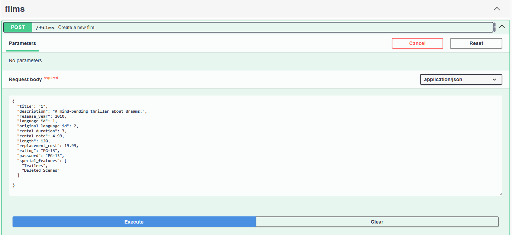
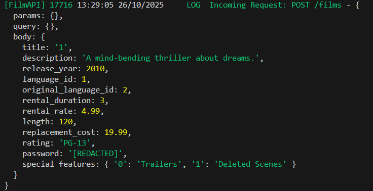
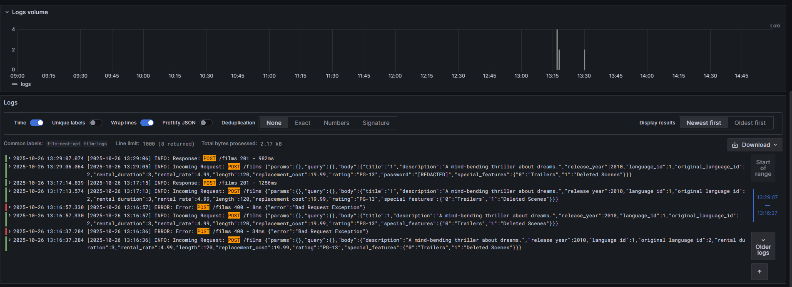
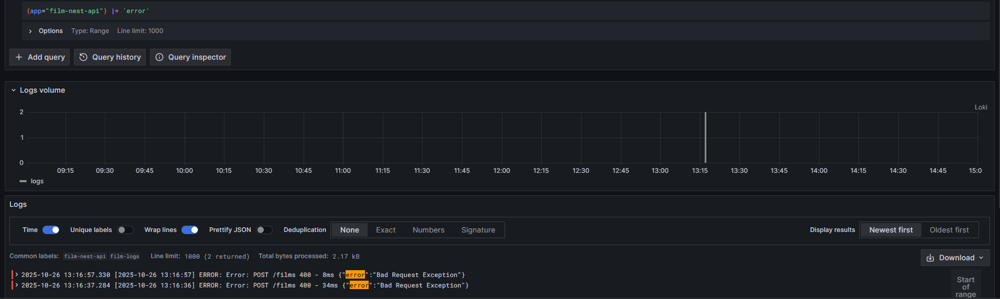

# Promtail → Loki → Grafana (tail `./logs`)

This document explains how to configure Promtail to tail the log files in the project's `./logs` directory and send them to Loki, then use Grafana to visualize them.

Goals:

- Promtail reads files `./logs/*.log` and pushes them to Loki (`http://loki:3100`).
- Grafana connects to Loki to view logs.

Contents:

- Files added/modified
- How to run (PowerShell)
- How to check / debug
- Options: parse JSON, patterns, notes

---

## Related files (present in the project)

- `promtail-config.yaml` — Promtail configuration (at project root)
- `docker-compose.yml` — contains services `loki`, `grafana`, `promtail` (Promtail mounts `./logs`)
- `loki-config.yaml` — Loki configuration (if using local filesystem)

If you do not have these files yet, see the "How to run" section to create them or ask me to generate them automatically.

---

## promtail-config.yaml (current)

Promtail has been configured to tail all `*.log` files under the `/logs` directory (container path). The config file is located at `promtail-config.yaml`.

Note: The Promtail container will mount the project's `./logs` into `/logs` inside the container; therefore `__path__: /logs/*.log` will match the log files in the project's logs directory.

---

## Run (PowerShell)

1. Start Loki, Grafana, and Promtail:

```powershell
docker-compose up -d loki grafana promtail
```

2. Check containers are running:

```powershell
docker-compose ps
```

3. Check Loki readiness (optional) (you may need to wait ~15s for the Loki container to become ready):

```powershell
curl http://localhost:3100/ready
```

4. Generate sample activity via Swagger

Open the Swagger UI at http://localhost:3000/api and send a few API requests (for example: create a film, list, update, or delete).

The goal is to produce real application logs — each request should be written to a log file (located at ./logs/app-YYYY-MM-DD.log).

After sending several successful requests, you can open the log file or check Grafana to see the corresponding records that Promtail collected and forwarded to Loki.

5. Open Grafana (for example `http://localhost:3001`) → Explore → select the `Loki` datasource → query:

```
{app="film-nest-api"}
```

Or filter by the job/label configured in `promtail-config.yaml` (`job: film-logs`, `app: film-nest-api`).

To find more specific logs, for example only lines containing an HTTP method or an error message, add a text filter like:

```
{app="film-nest-api"} |= "POST"
{app="film-nest-api"} |= "GET"
{app="film-nest-api"} |= "error"
```

# DEMO

## Security:

The LoggingInterceptor automatically logs all incoming HTTP requests and outgoing responses in the NestJS application. It records details like method, URL, and duration while safely redacting sensitive information (e.g., passwords, tokens) before writing logs via Winston, making them secure and easy to visualize in tools like Loki and Grafana.
- Create a post request on swagger (with a password field in the request body):

- Log result (with password is hidden with alias: "[REDACTED]"):


## Grafana:

After create api logs on swagger, we can search on Grafana.
Example:

- Query 'POST' request on Grafana:
  

- Query 'error' request on Grafana:
  
